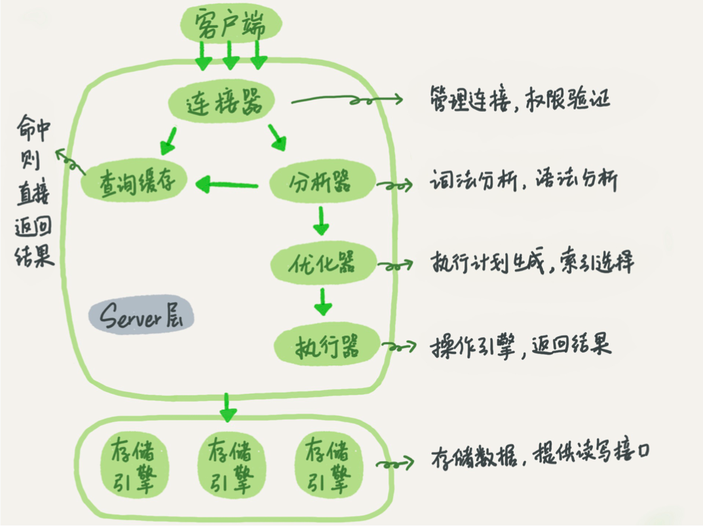
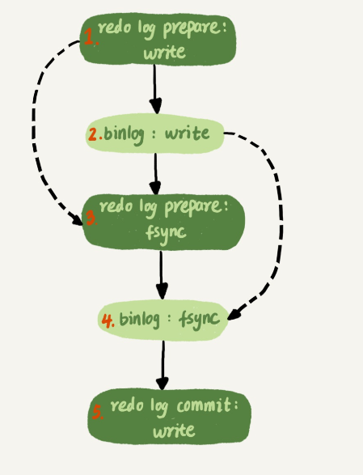
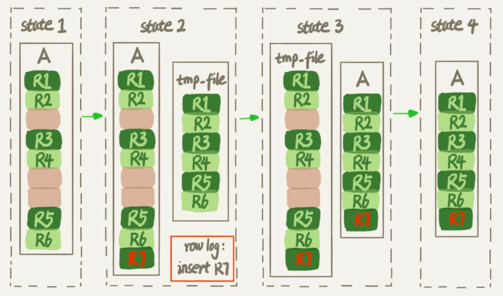
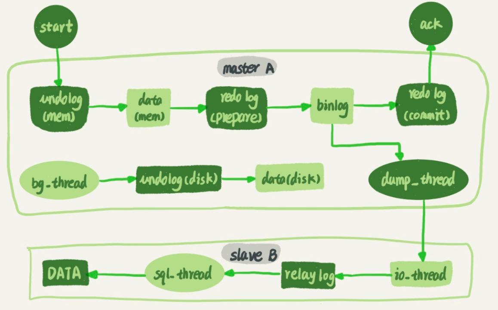

# 0常用命令

- show global VARIABLES LIKE '%capacity%'; //查询关键配置信息。
- SET GLOBAL innodb_io_capacity = 2000;  //设置配置信息。
- innodb_file_per_table //建议设置为on，表数据单独存储在.ibd文件中；通过drop table会直接删除这个文件。
- 排查优化可以查看慢查询日志，需要设置参数。
- tmp_table_size限制了内存临时表的大小，默认值是16M，如果大小大于这个值会转为磁盘临时表
- select blocking_pid from sys.schema_table_lock_waits 找出造成阻塞的process id，用kill 命令断开。
- **Show processlist查看执行过程**
- 查information_schema库的innodb_trx表，查看事务。
- kill connection + id 命令，断开连接。s

# 1基础架构

sql语句在MySQL中的各个功能模块中的执行过程如下图。



大体来说，MySQL分为Server层和存储引擎层两部分：

- Server层：所有跨存储引擎的功能都在这一层实现，比如存储过程、触发器、试图等。

  - 连接器：负责跟客户建立连接、获取权限、维持和管理链接。

    - show processlist查询连接状态。
    - 连接默认时间8小时，由wait_timeout控制。
    - Mysql在执行过程中临时使用的内存管理在连接对象里面，长连接积累会导致内存占用太大，可通过执行mysql_reset_connection重新初始化连接资源。

  - 查询缓存：Mysql8.0之后彻底删除这个功能。

    - 以key-value对的形式直接缓存到内存中。

    - 失效频繁，对一个表更新，此表上所有查询缓存清空。

    - query_cache_type设置DEMAND，默认不查缓存。

    - 显示指定:

      ```mysql
      select SQL_CACHE * from T where ID=10;
      ```

  - 分析器：识别语句中的关键字，之后对sql语句做语法分析，语句错误会有You have an error in your SQL syntax提醒，提示第一个出错的位置，关注紧接“use near”内容。

  - 优化器：在mysql执行之前，需要先经过优化器处理。

    - 使用哪个索引。
    - join语句中选择表的连接顺序。

  - 执行器：执行语句。

    - 判断对表有没有权限。
    - 没有索引直接每行对比是否符合where，符合存在结果集中。
    - 有索引，调用引擎查询满足条件的数据，rows_examined表示语句执行器扫描多少行（与引擎扫描行不全相同）。

- 存储引擎：负责数据存储和提取，架构师插件式的，支持多种存储引擎。

# 2日志系统

当有一条记录需要更新的时候，InnoDB 引擎会把记录写到redolog中，并更新内存。InnoDB引擎会在适当时候，将记录更新到磁盘里，在系统空闲的时候，刷到磁盘。

## redolog


- InnoDB特有日志，提示性能。
- crash-safe能力，发生异常，之前提交记录不会丢失。
- 循环覆盖写入，如果write pos追上check point表示写满了。
- 记录数据页的无力修改，用来恢复提交后的物理数据页，且只能恢复到最后一次提交的位置。
- innodb_flush_log_at_trx_commit设置为1，每次事物redolog直接持久化到磁盘。

### redo log写入机制

- innodb_flush_log_at_trx_commit：
  - 设置为0，每次事物提交时都只把redo log保留在redo log buffer。
  - 设置为1，事物提交把redo log直接持久化到磁盘。
  - 设置为2，每次事物提交都把redo log写到page cache。
  - 

## binlog

- Server层。
- 用来归档，没有crash-safe能力。
- 追加写入，写入前，redolog处于prepare阶段，写入成功后，redolog处于commit。
- sync_binlog设置为1，每次事物binlog持久化磁盘。

### binlog写入机制

- 事物执行过程中，先把日志写到binlog cache，事物提交时候，再把binlog cache写到binlog文件中。
- sync_binlog=0，表示每次提交事物只write，不fsync。
- sync_binlog=1，表示每次提交事物都会执行fsync。
- sync_binlog=N，表示每次提交事物都write，但积累N个事物才fsync

## WAL机制（预写式日志）

两阶段提交：



## WAL机制快的原因

- redo log 和 binlog都是顺序写，磁盘的顺序写比随机写速度要快;
- 组提交机制，可以大幅度降低磁盘的IOPS消耗。

## 提升binlog组提交效果

Bingo write和fsync由参数sync_binlog控制：

1. sync_binlog=0的时候，表示每次提交事务都只write，不fsync;。
2. sync_binlog=1的时候，表示每次提交事务都会执行fsync;
3. sync_binlog=N(N>1)的时候，表示每次提交事务都write，但累积N个事务后才fsync。

InnoDB提供了innodb_flush_log_at_trx_commit参数，它有三种 可能取值:

1. 设置为0的时候，表示每次事务提交时都只是把redolog留在redologbuffer中; 
2. 设置为1的时候，表示每次事务提交时都将redolog直接持久化到磁盘;
3. 设置为2的时候，表示每次事务提交时都只是把redolog写到pagecache。

提升binlog效果：

- binlog_group_commit_sync_delay参数，表示延迟多少微秒后才调用fsync
- binlog_group_commit_sync_no_delay_count参数，表示累积多少次以后才调用fsync。

两个是或的关系；考虑使用以下三种方法：

1. 设置 binlog_group_commit_sync_delay和 binlog_group_commit_sync_no_delay_count参数，减少binlog的写盘次数。这个方法是基于“额外的故意等待”来实现的，因此可能会增加语句的响应时间，但没有丢失数据的风险。
2. 将**sync_binlog**设置为大于1的值(比较常见是100~1000)。这样做的风险是，主机掉电时 会丢binlog日志。
3. 将**innodb_flush_log_at_trx_commit**设置为2。这样做的风险是，主机掉电的时候会丢数据。

# 3索引

## InnoDB索引

- InnoDB采用B+树结构，很好配合磁盘的读写特性，减少单次查询的磁盘访问次数。

- 建议一个自增主键，非主键索引占用的空间最小。

- 字符串上建索引限制长度。

- MySQL5.6之前，覆盖索引会一个个回表。

  

- 5.6引入索引下推执行流程。

  

## InnoDB数据删除，大小不变

- alter table A engine=InnoDB命令重建表

- 在MySql5.6之前，在DDL过程中，表A不能更新，这个DDL不是Online的。

- MySql5.6引入Online DDL，对这个流程做了优化。

  

  - 为了实现Online，alter语句在启动时需要获取MDL写锁，在拷贝数据前退化为读锁，禁止其他线程对表DDL。
  - tmp_file临时文件时InnoDB在内部创建到临时表的，对server层来说没有挪动。
  - 在重建表的时候，InnoDB在每个页预留1/16给后续使用。

## MySQL选错索引

- show index from t; 查看索引情况，索引的统计值不够精确。
- 最重要的是，优化器预估的扫描行数不准确。
- 优化器选择索引的时候会考虑回表的代价，不是只选择扫描行数少的索引。
- analyze table t;会修正信息，可以用来重新统计索引信息。
- 解决方法：
  - force index(a)
  - 修改语句，引导选择索引(不推荐)
  - 建立更合适的索引或者删掉误用的索引。

## 普通索引与唯一索引

### 查询过程

唯一索引会在查询到数据后直接返回，而普通索引需要继续遍历后续直到查询条件不满足，除了查询数据页中最后一条数据需要增加一次IO以外，性能损失微乎其微。

### 更新过程

- change buffer：

  - 针对普通索引。
  - change buffer使用buffer pool中内存，不能无线增大。
  - change buffer大小，通过参数innodb_change_buffer_max_size动态设置，设置50最多占用50%buffer pool。

- 普通索引更新过程：

  - 将更新操作（5.5后支持delete、update）缓存在change buffer中，这样不需要从磁盘读取数据页。
  - 下次访问时，将数据页读入内存，后执行change buffer相关操作。
  - change buffer在内存中有拷贝，也会被写入到磁盘上。
  - 将change buffer中操作应用到原数据页，得到最新的结果称为merge。访问这个数据页、数据库正常关闭、系统后台线程定期都会merge。

- change buffer使用场景：

  - 写多读少，页面在写完以后被访问的概率比较小，change buffer效果好。
  - 机械硬盘效果更好。尽量普通索引，change buffer开大。

- change buffer和redo log

  - redo log节省的是随机写磁盘的IO（转化为顺序写），change buffer主要节省是随机读磁盘的IO消耗。

  - 如果数据页在内存中，直接更新内存，所有操作完成后记录在redo log中。
  - 数据页不在内存中，就在内存的change buffer区域记录操作。记录到redo log。
  - 读数据的时候，内存中有数据页直接返回。
  - 读数据的时候，无数据页，有change buffer，从磁盘中读入内存，应用change buffer操作日志，返回正确结果。

- merge的执行流程：

  - 从磁盘中读入数据页到内存。
  - 从change buffer找出数据页的change buffer记录，依次应用，得到新数据页。
  - 写redo log，包含了数据的变更和change buffer变更。（刷回磁盘是另一个过程）

# 4锁

## 全局锁

- 对整个数据库加锁，只读不可写。
- 官方自带逻辑备份工具时mysqldump，参数-single-transaction
- 无事物引擎的库，命令flush tables with read lock
- 尽量不使用set global readonly=true方式。
  - 这个值被用来判断其他逻辑，如判断是主库还是从库。
  - 客户端发生异常，数据库一直保持readonly状态，导致库一直不可写。

## 表级锁

### 表锁

- lock tables ... read/write。unlock tables主动释放锁。客户端断开自动释放锁。
- 本线程申请了什么权限，后续只能执行什么操作。

### 元数据锁（metadata lock）

- 不需要显示使用，访问一个表的时候会自动加上。
- 对表做增删改查，加MDL读锁，对表结构做变更，加MDL写锁。
- MDL直到事物提交会释放，表结构变更时，小心不要导致锁住线上查询和更新。会阻塞后续MDL读锁。

## 间隙锁

 innodb_locks_unsafe_for_binlog 这个参数就是这个意思 “不加gap lock”，

这个已经要被废弃了(8.0就没有了)，所以不建议设置哈，容易造成误会。 如果真的要去掉gap lock，可以考虑改用RC隔离级别+binlog_format=row

## 可重复读加锁规则

- 原则1：加锁的基本单位是临界锁，前开后闭。
- 原则2：查找过程中访问到的对象才会加锁。
- 优化1：索引上等值查询，给唯一索引加锁的时候，临界锁退化为行锁。
- 优化2：索引上的等值查询，向右遍历且最后一个值不满足等值条件的时候，临界锁退化为间隙锁。
- bug：唯一索引的范围查询会访问到不满足条件的第一个值为止。

# 5页

## 内存脏页刷新机制

- redolog写满了，flush脏页。（尽力避免）
- 内存不够，先写脏页到磁盘。（常态）InnoDB用缓存池（buffer pool）管理内存，缓存池中内存页有三种状态：
  - 还没有使用。
  - 使用了并且干净页。
  - 使用了并且脏页。
- Mysql认为系统空闲的时候，会刷脏页。
- Mysql关闭的时候。

会影响性能：

- 一个查询要淘汰的脏页太多，导致查询响应时间明显变长。
- 日志写完，更新全部堵住，写性能为0。

## InnoDB刷脏页的控制策略

- innodb_io_capacity：InnoDB的磁盘能力，建议设置为磁盘的IOPS，fio工具检测
- innodb_max_dirty_pages_pct：设置脏页比例，默认值75%
- innodb_flush_neighbors ：刷相邻脏页，0为只刷自己

# 6知识点

- Server层只给要的值，InnoDB只给必要的值。

- count(?)不同的语义的效率：count(字段)<count(主键id)<count(1)≈count(\*)，尽量使用count(\*)
  - count(主键id)，InnoDB引擎会遍历整张表，把每一行id取出来，返回到server层，server层拿到id后，判断不为空按行累加。
  - count(1)，InnoDB遍历整张表，不取值，server层对于返回的每一行，放1进去，按行累加。
  - count(字段)，字段not null的话，累加。
  
- Order by:尽量对排序字段加索引，否则会使用临时表排序。

- order by rand()使用了内存临时表，内存临时表排序的时候使用了rowid排序方法。

  - 代价比较大，慎用。

  - 临时文件排序算法：归并排序，排序好了全部数据，如果只排序几个，采用优先队列排序

- 

# 7索引性能

- **explain是很好的习惯**
- 对索引字段做函数操作，可能会破坏索引值的有序性，因此优化器就决定放弃走树搜索功能。
- 隐式类型转换。
- 隐式字符编码转化。

# 8排查方案

- 线上紧急创建索引，先在备库执行set sql_log_bin=off，即不写binlog，然后执行alter table加索引，之后主备切换，执行相同操作。
- 查询重写，call query_rewrite.flush_rewrite_rules()语句重写查查询操作。
- 注重慢查询日志的使用。long_query_time设置。

# 9主从同步

- 备库设置为只读模式：

  - 运营类查询语句会在备库上查，设置为只读可防止误操作。
  - 防止切换逻辑有bug，切换过程出现双写，造成主备不一致。
  - 用readonly判断节点角色。

- 主备流程图：

  

  1. B通过change master命令，设置主库A的IP、端口、用户名、密码，binlog文件名和日志偏移量。
  2. 备库B执行start slave命令，启动io_thread和sql_thread，其中io_thread与主库建立连接。（sql_thread演化为多线程）
  3.  A校验完用户名、密码后，按照B闯过位置，从本地读取binlog发送给B。
  4. B拿到binlog，写到本地文件，即中转日志（relay log）
  5. sql_thread读取中转日志，解析日志命令，并执行。

- binlog三种格式详细参考45讲-24。
  - statement格式，记录语句，可能会有误删操作。
  - *row按行记录，不会误删，按操作行，但很占空间，会影响性能。
  - mixed，判断是否会引起主备不一致。

- 用binlog恢复数据标准做法，用mysqlbinlog工具解析出来，把解析结果整个发给mysql执行。

- M-S结构。双M结构，容器产生循环复制问题，通过serverid判断，是自己的binlog不操作。
